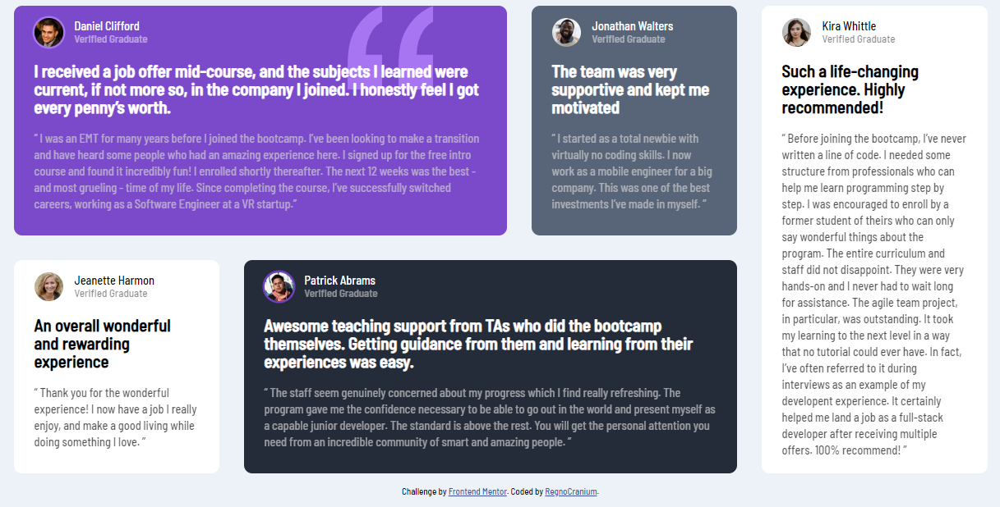
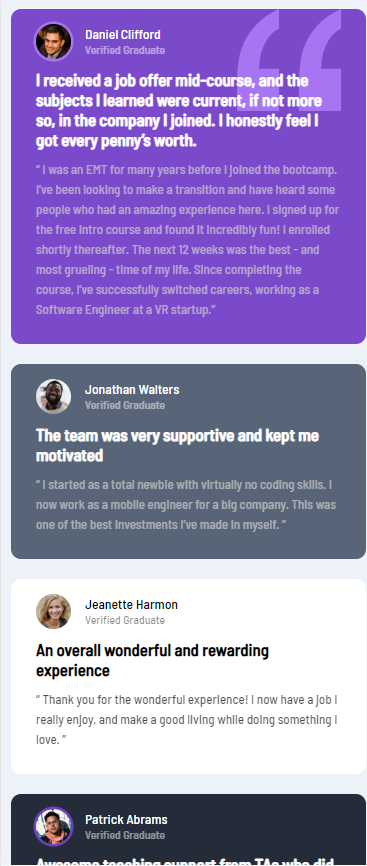

# Frontend Mentor - Testimonials grid section

## Table of contents

- [Overview](#overview)
  - [The challenge](#the-challenge)
  - [Screenshot](#screenshot)
  - [Links](#links)
- [My process](#my-process)
  - [Built with](#built-with)
  - [What I learned](#what-i-learned)
  - [Continued development](#continued-development)
  - [Useful resources](#useful-resources)
- [Author](#author)
- [Acknowledgments](#acknowledgments)

## Overview

Testimonials grid section

### The challenge

Users should be able to:

- View the optimal layout for the component depending on their device's screen size

### Screenshot

### Links

- Github pages: [https://regnocranium.github.io/testimonials/](https://regnocranium.github.io/testimonials/)

## My process

### Built with

- Flexbox
- Mobile-first workflow

### What I learned

Learned flexbox and used it for the first time

### Continued development

Better naming of divs. Semantic HTML. Be better at CSS.

### Useful resources

- [Example resource 1](https://www.youtube.com/watch?v=zJSY8tbf_ys&ab_channel=freeCodeCamp.org) - Learned everything from here.
- [Example resource 2](https://yoksel.github.io/flex-cheatsheet/#section-declaring) - Helped with flexbox.

## Author

- Frontend Mentor - [@RegnoCranium](https://www.frontendmentor.io/profile/RegnoCranium)
- Github - [@RegnoCranium](https://github.com/RegnoCranium)

## Acknowledgments

Thanks freeCodeCamp and Zach
